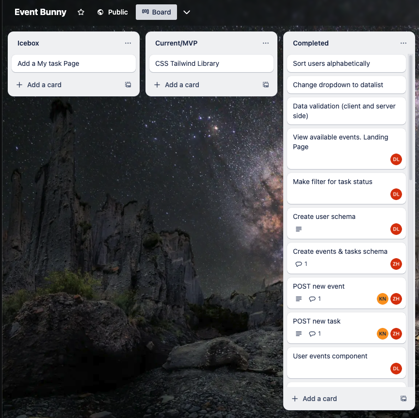
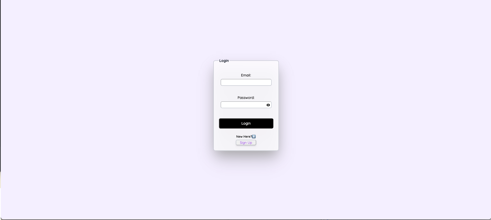
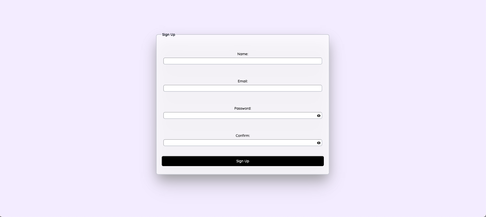
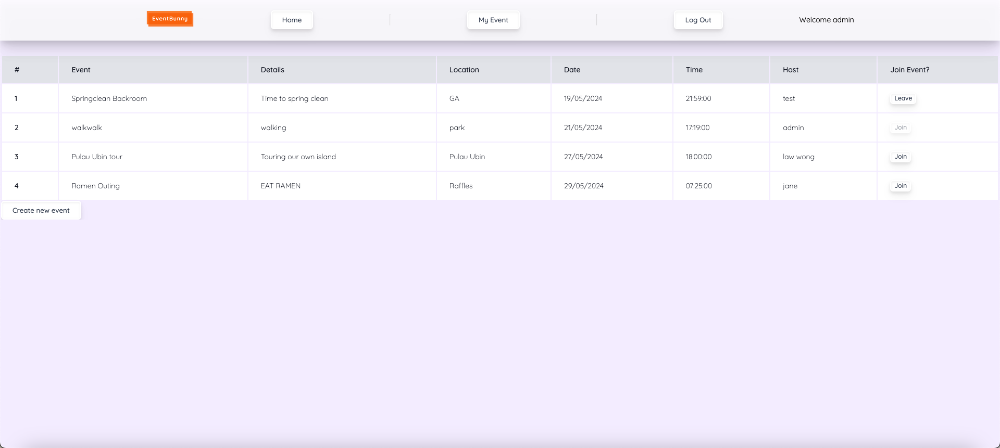
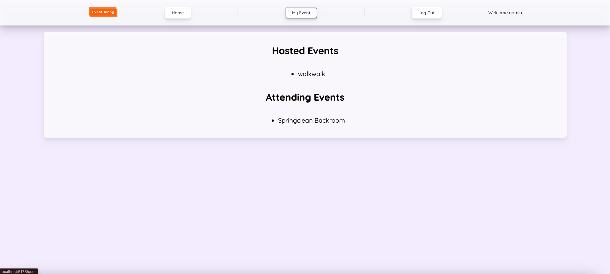
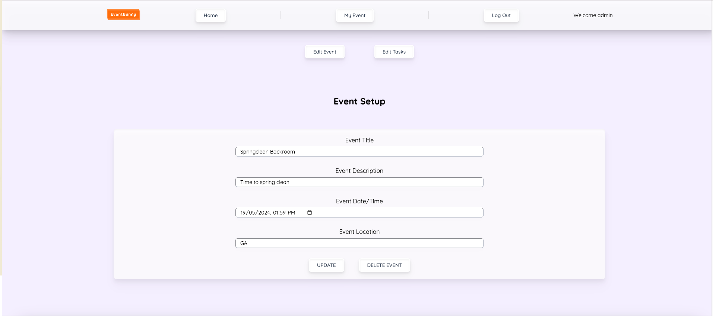
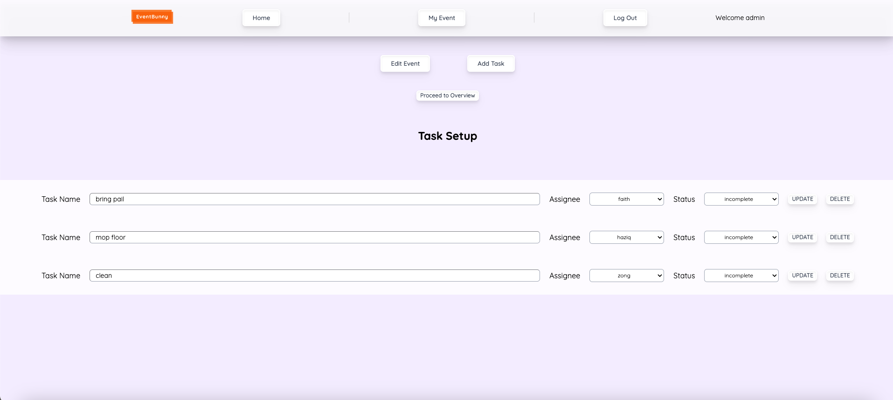

# Event Bunny

Deployed on https://eventbunny.onrender.com

Wireframe-Figma: (https://www.figma.com/board/5YgTMJFPrdI1myointvs4L/Event-Bunny?node-id=0-1&t=ia3y9YoB7H06JqBD-0)

Trello: (https://trello.com/b/kGkjvRmj/event-bunny)

Sample Schema: (https://docs.google.com/spreadsheets/d/1CN5hkQg4CIRCpQrwUxx0HWT5wNpvSvbxbyL64JnFiXk/edit#gid=1674818169)

## Contribution

### Delyn

- GitHub Manager

#### Favourite React Component

EventOverviewPage, allowing users to join in to events that they are not hosting as an attendee and if they are already an attendee they are able to leave the event. Seems like a normal button but it took us many rounds of debugging to make it work smoothly.

#### Key Challenges

As we each take on certain portions of the project, it takes awhile to get used to and incorporate your codes to make sure everything is flowing smoothly as everyone has different styles in code writing. Alot of communication is needed to ensure we are aware of major changes made while we do our own parts.

#### Learnings/Takeaways

People always say that working in a group is the hardest part of the project, but for me that was the best part as my teammates were very patient and guided me whenever I am in doubt. Through this project, I am able to learn more from them as they kindly share their thought process and guided me on how to troubleshoot my own codes. Communication is key!

### ZongHan

- Express Lead

#### Favourite React Component

UserTimeout! It checks if user is still logged in for each navigate/fetch functions and redirects the user to a autologout page. This is wrapped over all the existing routes for "navigate", but had to be individually added into each component with fetch functions.

#### Key Challenges

Solving bugs wasnt as simple if the codes were not written by you, since there could be a very minor line missed out, or difference in style resulting in that bug. Using the debug logging at each line was how we managed to solve these issues for one another. Nonetheless, was very happy with the outcome, we achieved almost all of what we had set out to do in the planning stage.

#### Learnings/Takeaways

Early testing, as part of planning, of the routes using bruno was very helpful to see what was possible, and which model schema should be the 'owner' in a referencing method. Validation in server side(controller & model)

### Kavin

- React Lead

#### Favourite React Component

Task Setup Page - This component is able to fetch users and event and handle the updating, deleting, creating and editing of tasks. It is also able to conditionally render an edit form and create form.

#### Challenges

Finding out what data I have to send from the front end to the back end and making sure the front end, routes, controllers, api and service all sync up. It was also hard to debug code sometimes because there are so many files that correlate with each other.

#### Learnings

Learnt how to do validation in the front end, how to use the uselocation hook, how to use tailwind and how to create reusable ui components.

## Wireframe

Trello

Dashboard

My events

Event Details Page

Event Setup Page

Task Setup Page

## User Stories

User : Work in a large team grouped into smaller sections, each section is responsible for organizing different events. Each events will have support from other sections.

As a user,

- I want to create an app to manage the many different events organised by the different sections.
- I want to be able to host events and delegate responsibilities/tasks to other team members.
- I want to see events organised by others, and see my responsibilities/tasks allocated.

## Screenshots

Log In

Sign Up

Event Overview Page

My Event Page

Event Details Page

Event Setup Page

Task Setup Page

## Icebox

- Add a My Task summary page

## Technologies Used

- MongoDB & Mongoose
- Express framework
- React
- Node.js
- TailwindCSS
- Render deployment
- Git & GitHub
- Vite
- Figma
- Trello
