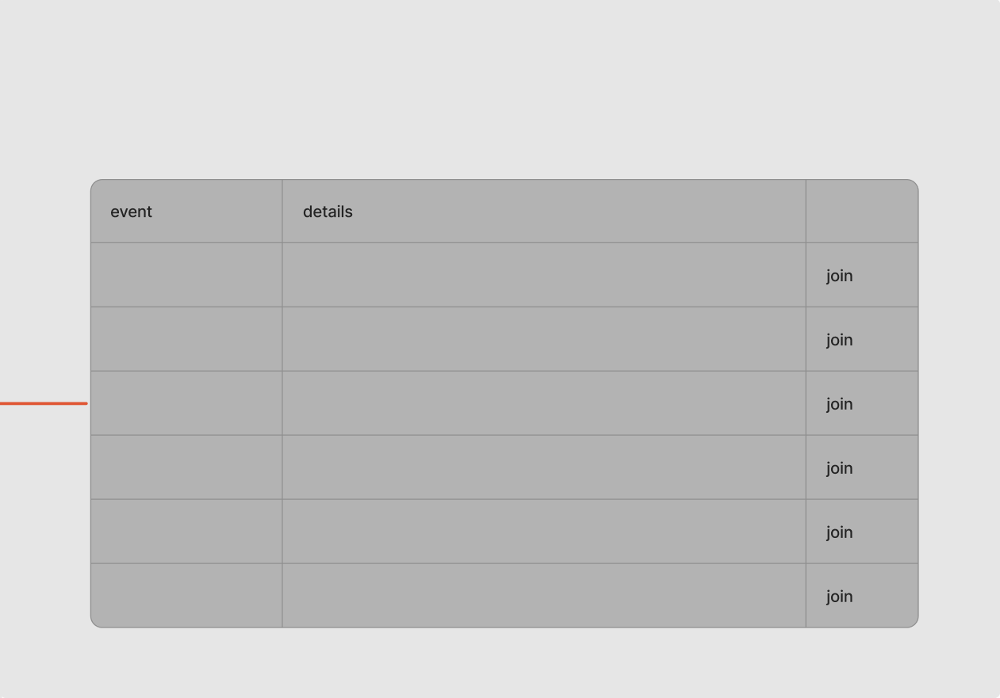
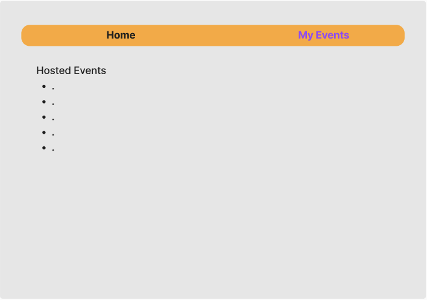
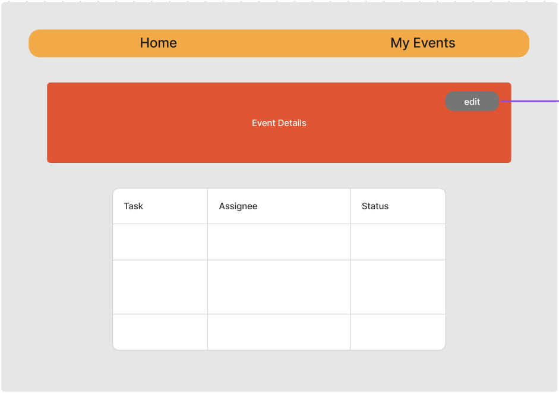
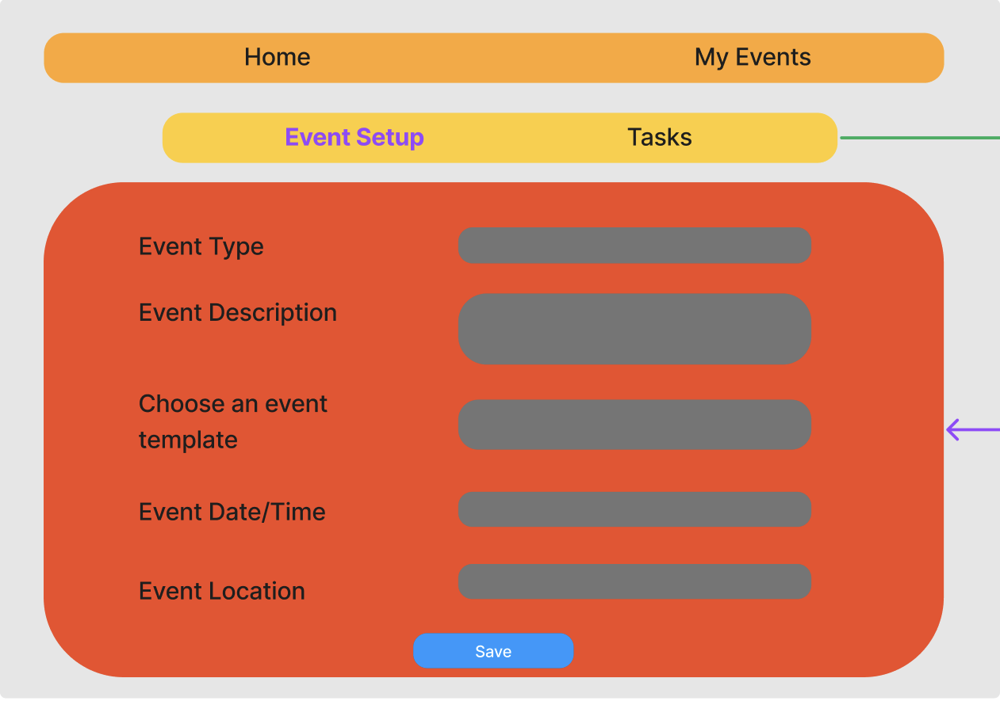
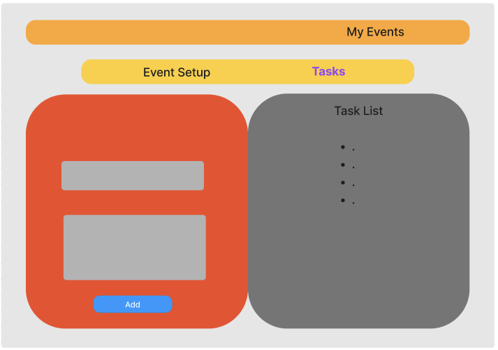
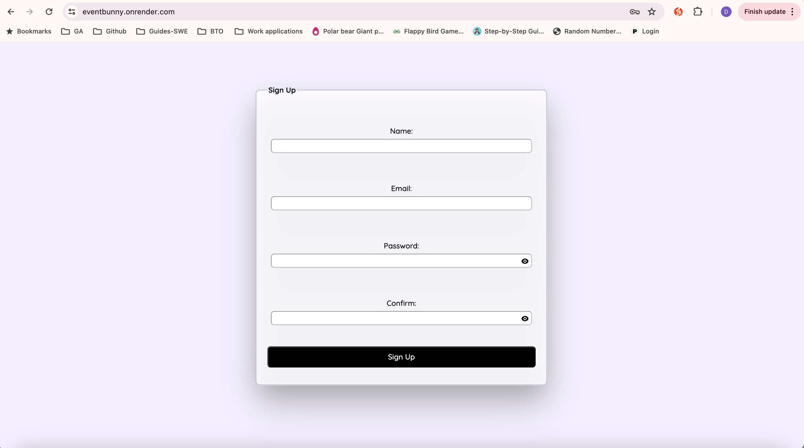
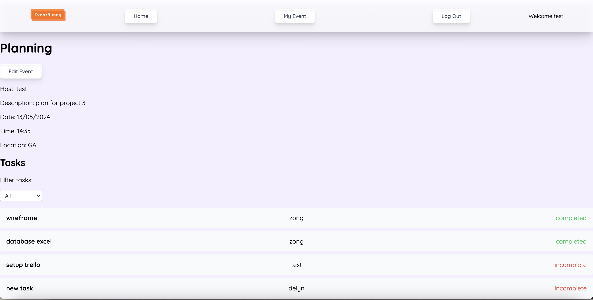
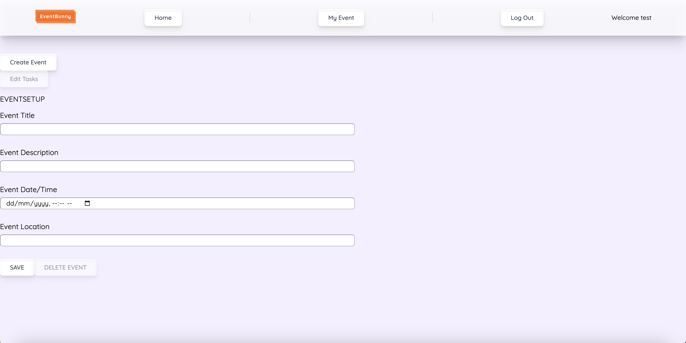

# Event Bunny

Deployed on https://eventbunny.onrender.com

Wireframe-Figma: (https://www.figma.com/board/5YgTMJFPrdI1myointvs4L/Event-Bunny?node-id=0-1&t=ia3y9YoB7H06JqBD-0)

Trello: (https://trello.com/b/kGkjvRmj/event-bunny)

Sample Schema: (https://docs.google.com/spreadsheets/d/1CN5hkQg4CIRCpQrwUxx0HWT5wNpvSvbxbyL64JnFiXk/edit#gid=1674818169)

## Contribution

### Delyn

- GitHub Manager

### ZongHan

- React Lead

### Kavin

- Express Lead

## Wireframe

Trello

Dashboard

My events

Event Details Page

Event Setup Page

Task Setup Page

## User Stories

User : Work in a large team grouped into smaller sections, each section is responsible for organizing different events. Each events will have support from other sections.

As a user,

- I want to create an app to manage the many different events organised by the different sections.
- I want to be able to host events and delegate responsibilities/tasks to other team members.
- I want to see events organised by others, and see my responsibilities/tasks allocated.

## Screenshots

Log In

Sign Up

Event Details Page

Event Setup Page

## Technologies Used

- MongoDB & Mongoose
- Express framework
- React
- Node.js
- TailwindCSS
- Render deployment
- Git & GitHub
